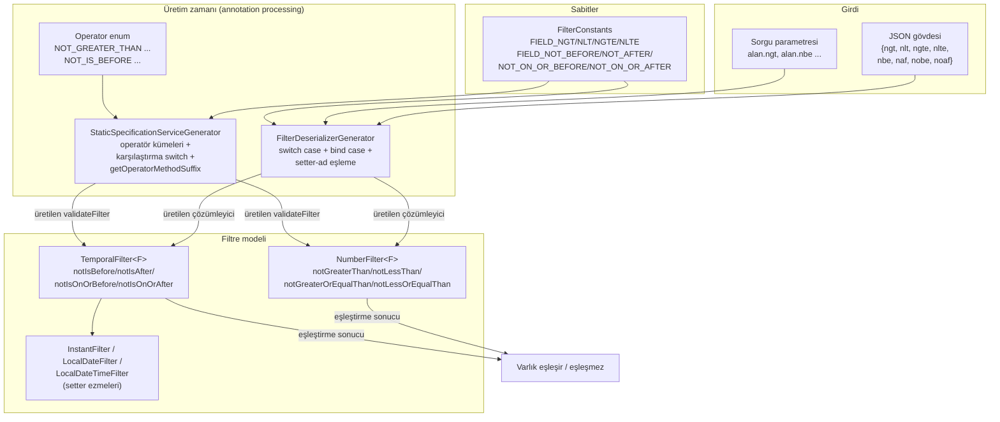

# Tasarım Dokümanı

## Genel Bakış

Bu tasarım, `NumberFilter<F extends Comparable>` ve `TemporalFilter<F extends Comparable>` filtre ailelerine mevcut pozitif karşılaştırma operatörlerinin mantıksal olumsuz (negated) versiyonlarını ekler. Amaç, Gereksinim Dokümanı'ndaki 16 gereksinimi tam olarak karşılamaktır:

- **NumberFilter**: `notGreaterThan` (`ngt`), `notLessThan` (`nlt`), `notGreaterOrEqualThan` (`ngte`), `notLessOrEqualThan` (`nlte`) — sırasıyla `greaterThan`/`gt`, `lessThan`/`lt`, `greaterOrEqualThan`/`gte`, `lessOrEqualThan`/`lte` operatörlerinin mantıksal tersleri.
- **TemporalFilter**: `notIsBefore` (`nbe`), `notIsAfter` (`naf`), `notIsOnOrBefore` (`nobe`), `notIsOnOrAfter` (`noaf`) — sırasıyla `isBefore`/`be`, `isAfter`/`af`, `isOnOrBefore`/`obe`, `isOnOrAfter`/`oaf` operatörlerinin mantıksal tersleri.

Tasarımın temel ilkesi: **her olumsuz operatör, karşılık geldiği pozitif operatörün mantıksal tersidir** (null olmayan alan değerleri için). Bu, mevcut kod tabanındaki tekdüze desene (aynı alan yapısı, aynı JSON çözümleme akışı, aynı `getOperatorMethodSuffix` tabanlı üretim mantığı) sıkı sıkıya uyularak, minimum yeni kavram getirilerek gerçeklenir.

Kapsam kararı olarak, `TemporalFilter` üzerindeki `last`/`next` göreli zaman ön ayarları (`TemporalPreset`) **kapsam dışıdır** (Gereksinim 6). Bu alanların olumsuz versiyonu tanımlanmaz ve mevcut davranışları korunur.

Bu doküman, `requirements.md` içindeki onaylanmış gereksinimleri temel alır ve değişiklik yüzeyindeki her bileşen için tam üye adlarını (alan, sabit, enum değeri, metot) mevcut kaynak kodda okunan gerçek adlarla belirtir.

## Mimari / Etkilenen Bileşenler

Özellik, tek bir uçtan uca akışı (JSON gövdesi veya sorgu parametresi → filtre nesnesi → varlık eşleştirme) izleyen aşağıdaki bileşenleri etkiler. Hiçbiri sıfırdan yeni bir mimari getirmez; hepsi mevcut sınıflara **ekleme (additive)** yapar.

| Katman | Bileşen | Değişiklik Türü |
| --- | --- | --- |
| Filtre modeli | `NumberFilter<F>` | 4 alan + erişimci + kopyalama/equals/hashCode/toString eklemeleri |
| Filtre modeli | `TemporalFilter<F>` | 4 alan + erişimci + kopyalama/equals/hashCode/toString eklemeleri |
| Filtre modeli (alt sınıf) | `InstantFilter`, `LocalDateFilter`, `LocalDateTimeFilter` | 4 setter ezmesi (override) her biri |
| Paylaşılan sabitler | `FilterConstants` | 8 yeni `String` sabiti |
| Operatör kümesi | `Operator` (enum) | 8 yeni enum değeri |
| Çözümleme üretici | `FilterDeserializerGenerator` | JSON switch case'leri (sayısal + temporal), sorgu parametresi bind case'leri, setter-ad eşleme switch'i |
| Eşleştirme üretici | `StaticSpecificationServiceGenerator` | Operatör kümeleri, karşılaştırma mantığı switch case'leri, `getOperatorMethodSuffix` eşlemeleri |
| Test paketi | `DoubleFilterTest`, `IntegerFilterTest`, `LongFilterTest`, `InstantFilterTest`, `LocalDateFilterTest`, `LocalDateTimeFilterTest`, `TemporalFilterTest` | Additive kapsam testleri (Gereksinim 16) |

### Bileşen Haritası



## Bileşenler ve Arayüzler

Bu bölüm her bileşen için eklenecek tam üyeleri, mevcut koddaki adlandırma ve desene bağlı kalarak belirtir.

### 1. NumberFilter (`filter/NumberFilter.java`)

Mevcut alanlar `greaterThan` (`@JsonProperty("gt")`), `lessThan` (`lt`), `greaterOrEqualThan` (`gte`), `lessOrEqualThan` (`lte`) desenine bire bir uyularak dört yeni alan eklenir.

**Yeni alanlar** (Gereksinim 1.1, 1.2):

```java
@JsonProperty("ngt")
private F notGreaterThan;
@JsonProperty("nlt")
private F notLessThan;
@JsonProperty("ngte")
private F notGreaterOrEqualThan;
@JsonProperty("nlte")
private F notLessOrEqualThan;
```

Argümansız kurucu bu alanları örtük olarak `null` bırakır (Gereksinim 1.5); ek kod gerekmez.

**Getter/chained setter** (Gereksinim 1.3, 1.4) — mevcut `setGreaterThan` desenindeki gibi `this` döndürür:

```java
public F getNotGreaterThan() { return notGreaterThan; }
public NumberFilter<F> setNotGreaterThan(F notGreaterThan) { this.notGreaterThan = notGreaterThan; return this; }
// notLessThan, notGreaterOrEqualThan, notLessOrEqualThan için aynı desen
```

**Kopyalama kurucusu** (Gereksinim 7.1) — mevcut `NumberFilter(NumberFilter<F> filter)` içine eklenir:

```java
this.notGreaterThan = filter.notGreaterThan;
this.notLessThan = filter.notLessThan;
this.notGreaterOrEqualThan = filter.notGreaterOrEqualThan;
this.notLessOrEqualThan = filter.notLessOrEqualThan;
```

**equals** (Gereksinim 8.1) — mevcut `Objects.equals(...)` zincirine eklenir:

```java
&& Objects.equals(notGreaterThan, that.notGreaterThan)
&& Objects.equals(notLessThan, that.notLessThan)
&& Objects.equals(notGreaterOrEqualThan, that.notGreaterOrEqualThan)
&& Objects.equals(notLessOrEqualThan, that.notLessOrEqualThan)
```

**hashCode** (Gereksinim 8.2) — mevcut `Objects.hash(...)` argümanlarına dört alan eklenir.

**toString** (Gereksinim 9.1) — mevcut çıktı stringine dört alanın ad ve değeri eklenir:

```java
", notGreaterThan=" + notGreaterThan +
", notLessThan=" + notLessThan +
", notGreaterOrEqualThan=" + notGreaterOrEqualThan +
", notLessOrEqualThan=" + notLessOrEqualThan +
```

### 2. TemporalFilter (`filter/TemporalFilter.java`)

Mevcut alanlar `isBefore` (`be`), `isAfter` (`af`), `isOnOrBefore` (`obe`), `isOnOrAfter` (`oaf`) desenine uyularak dört yeni alan eklenir. `last`/`next` alanlarına **dokunulmaz** (Gereksinim 6.1, 6.2).

**Yeni alanlar** (Gereksinim 3.1, 3.2):

```java
@JsonProperty("nbe")
private F notIsBefore;
@JsonProperty("naf")
private F notIsAfter;
@JsonProperty("nobe")
private F notIsOnOrBefore;
@JsonProperty("noaf")
private F notIsOnOrAfter;
```

**Getter/chained setter** (Gereksinim 3.3, 3.4) — mevcut `setIsBefore` deseniyle `TemporalFilter<F>` döndürür:

```java
public F getNotIsBefore() { return notIsBefore; }
public TemporalFilter<F> setNotIsBefore(F notIsBefore) { this.notIsBefore = notIsBefore; return this; }
// notIsAfter, notIsOnOrBefore, notIsOnOrAfter için aynı desen
```

**Kopyalama kurucusu** (Gereksinim 7.2), **equals** (8.3), **hashCode** (8.4), **toString** (9.2) — mevcut `isBefore`/`isAfter`/... satırlarının hemen ardına, `last`/`next` girişleri korunacak biçimde dört yeni alan eklenir.

### 3. Temporal alt sınıflar

`InstantFilter`, `LocalDateFilter`, `LocalDateTimeFilter` sınıfları mevcut `setIsBefore`/`setIsAfter`/`setIsOnOrBefore`/`setIsOnOrAfter` ezme (override) desenini izler: üst sınıf setter'ını çağırır, kendi somut tipini döndürür (Gereksinim 5.1–5.4).

Örnek (`InstantFilter`):

```java
@Override
public InstantFilter setNotIsBefore(Instant notIsBefore) {
    super.setNotIsBefore(notIsBefore);
    return this;
}
// setNotIsAfter, setNotIsOnOrBefore, setNotIsOnOrAfter için aynı desen
```

`LocalDateFilter` (tip `LocalDate`) ve `LocalDateTimeFilter` (tip `LocalDateTime`) için tip parametresi değişir; yapı aynıdır. Bu ezmeler yalnızca akıcı (fluent) API'nin alt sınıf tipini korumasını sağlar; asıl alan üst sınıfta tutulur (Gereksinim 5.4).

### 4. FilterConstants (`filter/FilterConstants.java`)

Mevcut `FIELD_GT`/`FIELD_GTE`/`FIELD_LT`/`FIELD_LTE` ve `FIELD_BEFORE`/`FIELD_AFTER`/`FIELD_ON_OR_BEFORE`/`FIELD_ON_OR_AFTER` desenine uyularak sekiz yeni sabit eklenir (Gereksinim 10.1, 10.2):

```java
// Sayısal olumsuz operatörler
public static final String FIELD_NGT = "ngt";
public static final String FIELD_NLT = "nlt";
public static final String FIELD_NGTE = "ngte";
public static final String FIELD_NLTE = "nlte";

// Temporal olumsuz operatörler
public static final String FIELD_NOT_BEFORE = "nbe";
public static final String FIELD_NOT_AFTER = "naf";
public static final String FIELD_NOT_ON_OR_BEFORE = "nobe";
public static final String FIELD_NOT_ON_OR_AFTER = "noaf";
```

### 5. Operator enum (`specification/Operator.java`)

Mevcut sayısal (`GREATER_THAN`, `LESS_THAN`, `GREATER_OR_EQUAL_THAN`, `LESS_OR_EQUAL_THAN`) ve temporal (`IS_BEFORE`, `IS_AFTER`, `IS_ON_OR_BEFORE`, `IS_ON_OR_AFTER`) değerlerinin yanına sekiz yeni değer eklenir (Gereksinim 11.1, 11.2):

```java
// Numeric negated
NOT_GREATER_THAN,
NOT_LESS_THAN,
NOT_GREATER_OR_EQUAL_THAN,
NOT_LESS_OR_EQUAL_THAN,

// Temporal negated
NOT_IS_BEFORE,
NOT_IS_AFTER,
NOT_IS_ON_OR_BEFORE,
NOT_IS_ON_OR_AFTER,
```

### 6. FilterDeserializerGenerator (`processor/generator/FilterDeserializerGenerator.java`)

Bu sınıf, filtre tipleri için Jackson çözümleyicilerini derleme zamanında üretir. Üç ayrı noktaya ekleme yapılır.

**(a) JSON gövdesi switch case'leri.** `generateNumericSwitchCases(...)` içinde mevcut `FIELD_GT → setGreaterThan` satırlarının ardına (Gereksinim 12.1–12.4):

```java
generateNumericSwitchCase(out, FilterConstants.class.getSimpleName() + ".FIELD_NGT", "setNotGreaterThan", parseMethod);
generateNumericSwitchCase(out, FilterConstants.class.getSimpleName() + ".FIELD_NGTE", "setNotGreaterOrEqualThan", parseMethod);
generateNumericSwitchCase(out, FilterConstants.class.getSimpleName() + ".FIELD_NLT", "setNotLessThan", parseMethod);
generateNumericSwitchCase(out, FilterConstants.class.getSimpleName() + ".FIELD_NLTE", "setNotLessOrEqualThan", parseMethod);
```

`generateTemporalSwitchCases(...)` içinde mevcut `FIELD_BEFORE → setIsBefore` satırlarının ardına (Gereksinim 12.5–12.8):

```java
generateSwitchCase(out, FilterConstants.class.getSimpleName() + ".FIELD_NOT_BEFORE", "setNotIsBefore", parseMethod);
generateSwitchCase(out, FilterConstants.class.getSimpleName() + ".FIELD_NOT_AFTER", "setNotIsAfter", parseMethod);
generateSwitchCase(out, FilterConstants.class.getSimpleName() + ".FIELD_NOT_ON_OR_BEFORE", "setNotIsOnOrBefore", parseMethod);
generateSwitchCase(out, FilterConstants.class.getSimpleName() + ".FIELD_NOT_ON_OR_AFTER", "setNotIsOnOrAfter", parseMethod);
```

Aynı ekleme, `generateMixedFieldTypeSwitchCases(...)` içindeki sayısal/temporal kollarında da yapılır (bu metot da `FIELD_GT`/`FIELD_BEFORE` gruplarını üretir). Üretilen switch, tanınmayan/bulunmayan alanları zaten atlar; dolayısıyla alanın olmaması veya `null` olması durumunda ilgili setter çağrılmaz ve alan `null` kalır (Gereksinim 12.10). Dönüştürülemeyen değerlerde mevcut `parseMethod`/`getXxxValue` akışı çalışma anında çözümleme istisnası fırlatır ve setter çağrılmaz (Gereksinim 12.9).

**(b) Sorgu parametresi bind case'leri.** Web binding üreten döngüde (`config.isNumeric()` / `config.isTemporal()` kolları) mevcut `generateBindCase(..., FIELD_GT, "setGreaterThan", false)` satırlarının ardına (Gereksinim 13.1–13.8):

```java
// isNumeric() kolu
generateBindCase(out, fieldName, filterType, fieldType, FilterConstants.FIELD_NGT, "setNotGreaterThan", false);
generateBindCase(out, fieldName, filterType, fieldType, FilterConstants.FIELD_NGTE, "setNotGreaterOrEqualThan", false);
generateBindCase(out, fieldName, filterType, fieldType, FilterConstants.FIELD_NLT, "setNotLessThan", false);
generateBindCase(out, fieldName, filterType, fieldType, FilterConstants.FIELD_NLTE, "setNotLessOrEqualThan", false);

// isTemporal() kolu
generateBindCase(out, fieldName, filterType, fieldType, FilterConstants.FIELD_NOT_BEFORE, "setNotIsBefore", false);
generateBindCase(out, fieldName, filterType, fieldType, FilterConstants.FIELD_NOT_AFTER, "setNotIsAfter", false);
generateBindCase(out, fieldName, filterType, fieldType, FilterConstants.FIELD_NOT_ON_OR_BEFORE, "setNotIsOnOrBefore", false);
generateBindCase(out, fieldName, filterType, fieldType, FilterConstants.FIELD_NOT_ON_OR_AFTER, "setNotIsOnOrAfter", false);
```

**(c) Setter-ad eşleme switch'i.** `generateElementOperatorBinding(...)` içindeki `setterMethod` switch'ine (koleksiyon içi iç filtreler ve çok seviyeli path'ler için kullanılır) yeni case'ler eklenir; böylece olumsuz operatörler koleksiyon-öğe filtrelerinde de tutarlı çalışır:

```java
case FilterConstants.FIELD_NGT -> "setNotGreaterThan";
case FilterConstants.FIELD_NGTE -> "setNotGreaterOrEqualThan";
case FilterConstants.FIELD_NLT -> "setNotLessThan";
case FilterConstants.FIELD_NLTE -> "setNotLessOrEqualThan";
case FilterConstants.FIELD_NOT_BEFORE -> "setNotIsBefore";
case FilterConstants.FIELD_NOT_AFTER -> "setNotIsAfter";
case FilterConstants.FIELD_NOT_ON_OR_BEFORE -> "setNotIsOnOrBefore";
case FilterConstants.FIELD_NOT_ON_OR_AFTER -> "setNotIsOnOrAfter";
```

### 7. StaticSpecificationServiceGenerator (`processor/generator/StaticSpecificationServiceGenerator.java`)

Bu sınıf, alan-operatör kombinasyonları için `validate...` metotlarını ve `validateFilter` mantığını üretir. Değişiklik üç noktada yapılır ve mevcut altyapı (özellikle `getOperatorMethodSuffix`) bunları otomatik olarak `validateFilter` içine bağlar.

**(a) Desteklenen operatör kümeleri.** Statik başlatma bloğundaki `numericOps` ve `dateTimeOps` kümelerine yeni operatörler eklenir (Gereksinim 11.3, 11.4):

```java
// numericOps kümesine
Operator.NOT_GREATER_THAN, Operator.NOT_LESS_THAN,
Operator.NOT_GREATER_OR_EQUAL_THAN, Operator.NOT_LESS_OR_EQUAL_THAN

// dateTimeOps kümesine
Operator.NOT_IS_BEFORE, Operator.NOT_IS_AFTER,
Operator.NOT_IS_ON_OR_BEFORE, Operator.NOT_IS_ON_OR_AFTER
```

**(b) `getOperatorMethodSuffix` eşlemeleri** (Gereksinim 11.5, 11.6). Bu, hem üretilen `validate{Field}{Suffix}` metot adını hem de `validateFilter` içindeki `get{Suffix}()` erişimci adını belirler:

```java
case NOT_GREATER_THAN -> "NotGreaterThan";
case NOT_LESS_THAN -> "NotLessThan";
case NOT_GREATER_OR_EQUAL_THAN -> "NotGreaterOrEqualThan";
case NOT_LESS_OR_EQUAL_THAN -> "NotLessOrEqualThan";
case NOT_IS_BEFORE -> "NotIsBefore";
case NOT_IS_AFTER -> "NotIsAfter";
case NOT_IS_ON_OR_BEFORE -> "NotIsOnOrBefore";
case NOT_IS_ON_OR_AFTER -> "NotIsOnOrAfter";
```

Böylece `generateFilterPropertyValidations(...)` her operatör için otomatik olarak şu kalıbı üretir:

```java
if (filter.getNotGreaterThan() != null && !validateXNotGreaterThan(entity, filter.getNotGreaterThan())) return false;
```

Bu, Gereksinim 14'ün tamamını (14.1–14.5) doğrudan karşılar: alan `null` değilse ilgili doğrulama metodu çağrılır, başarısız olursa `false` döner, pozitif ve olumsuz operatörler birlikte (mantıksal VE) uygulanır ve ayarlanmamış (`null`) operatör değerlendirmeye alınmaz (Gereksinim 15.3).

**(c) Karşılaştırma mantığı switch case'leri.** `generateValidationMethod(...)` içindeki büyük operatör switch'ine yeni case'ler eklenir. **Sayısal** (mevcut `GREATER_THAN` deseninde `compareTo` kullanılır, primitif tipler için doğrudan operatör):

| Operatör | Non-primitif üretim (Gereksinim) | Primitif üretim |
| --- | --- | --- |
| `NOT_GREATER_THAN` | `field != null && field.compareTo(value) <= 0` (2.1) | `field <= value` |
| `NOT_LESS_THAN` | `field != null && field.compareTo(value) >= 0` (2.2) | `field >= value` |
| `NOT_GREATER_OR_EQUAL_THAN` | `field != null && field.compareTo(value) < 0` (2.3) | `field < value` |
| `NOT_LESS_OR_EQUAL_THAN` | `field != null && field.compareTo(value) > 0` (2.4) | `field > value` |

**Temporal** (mevcut `IS_BEFORE` deseninde `LocalDate`/`LocalDateTime`/`Instant` için `isBefore`/`isAfter`, diğer Comparable için `compareTo` fallback):

| Operatör | Zaman_Tipi üretimi (Gereksinim) | compareTo fallback (Gereksinim 4.5) |
| --- | --- | --- |
| `NOT_IS_BEFORE` | `field != null && !field.isBefore(value)` (4.1) | `field != null && field.compareTo(value) >= 0` |
| `NOT_IS_AFTER` | `field != null && !field.isAfter(value)` (4.2) | `field != null && field.compareTo(value) <= 0` |
| `NOT_IS_ON_OR_BEFORE` | `field != null && field.isAfter(value)` (4.3) | `field != null && field.compareTo(value) > 0` |
| `NOT_IS_ON_OR_AFTER` | `field != null && field.isBefore(value)` (4.4) | `field != null && field.compareTo(value) < 0` |

Tüm üretilen kollarda `field != null` ön koşulu bulunur; bu, alan değeri `null` olduğunda kaydın eşleşmemesini (`false`) garantiler ve mevcut pozitif operatörlerle tutarlıdır (Gereksinim 2.5, 4.6). Karşılaştırma değeri (`value`) `null` durumunda ilgili operatör `validateFilter` içinde zaten çağrılmadığından (`getter != null` muhafazası) istisna oluşmaz (Gereksinim 2.6, 4.7).

## Veri Modelleri

Yeni veri yapısı eklenmez. Değişiklik, mevcut jenerik filtre modellerine alan eklemekten ibarettir:

- **NumberFilter<F extends Comparable<? super F>>**: mevcut dört karşılaştırma alanına ek olarak `notGreaterThan`, `notLessThan`, `notGreaterOrEqualThan`, `notLessOrEqualThan` (tümü `F`, JSON: `ngt`/`nlt`/`ngte`/`nlte`).
- **TemporalFilter<F extends Comparable<? super F>>**: mevcut dört karşılaştırma alanı + `last`/`next` (`TemporalPreset`) yanında `notIsBefore`, `notIsAfter`, `notIsOnOrBefore`, `notIsOnOrAfter` (tümü `F`, JSON: `nbe`/`naf`/`nobe`/`noaf`).

Tüm yeni alanlar isteğe bağlıdır (opsiyonel); atanmadığında `null` olur ve eşleştirmede değerlendirilmez. Bu, mevcut filtre alanlarının nullable semantiğiyle aynıdır.

## Doğruluk Özellikleri (Correctness Properties)

*Özellik (property), bir sistemin tüm geçerli çalışmalarında doğru kalması gereken bir karakteristik veya davranıştır; sistemin ne yapması gerektiğine dair biçimsel bir ifadedir. Özellikler, insan tarafından okunabilen belirtimler ile makine tarafından doğrulanabilen doğruluk garantileri arasında köprü kurar.*

Bu özellik, saf karşılaştırma mantığı (`compareTo`, `isBefore`/`isAfter`), serileştirme çevrimi ve yapısal değişmezler içerdiğinden özellik tabanlı testlere (PBT) uygundur. Ön çalışmadaki (prework) sınıflandırma ve özellik yansıması (property reflection) sonucunda, alt operatör başına ayrı özellikler tek kapsamlı özelliklerde birleştirilmiştir.

### Özellik 1: Sayısal olumsuzlama ikiliği (negation duality) ve compareTo tutarlılığı

*Her* `NumberFilter` olumsuz operatörü ve null olmayan bir alan değeri için, olumsuz operatörün eşleştirme sonucu, karşılık gelen pozitif operatörün sonucunun tam mantıksal tersine eşittir; ayrıca sonuç `compareTo` işaretiyle beklenen eşiğe uyar (`ngt`→`<=0`, `nlt`→`>=0`, `ngte`→`<0`, `nlte`→`>0`). Alan değeri `null` ise sonuç daima `false`'tur.

**Validates: Requirements 2.1, 2.2, 2.3, 2.4, 2.5**

### Özellik 2: Zamansal olumsuzlama ikiliği (negation duality)

*Her* `TemporalFilter` olumsuz operatörü, Zaman_Tipi (`LocalDate`, `LocalDateTime`, `Instant`) bir alan ve null olmayan bir karşılaştırma değeri için, olumsuz operatörün sonucu karşılık gelen pozitif operatörün sonucunun tam tersine eşittir (`nbe`→`!isBefore`, `naf`→`!isAfter`, `nobe`→`isAfter`, `noaf`→`isBefore`). Alan değeri `null` ise sonuç daima `false`'tur.

**Validates: Requirements 4.1, 4.2, 4.3, 4.4, 4.5, 4.6**

### Özellik 3: validateFilter mantıksal VE kombinasyonu

*Her* filtre (aynı anda ayarlanmış herhangi bir pozitif ve olumsuz operatör kombinasyonu) ve her varlık için, `validateFilter` sonucu `true`'dur ancak ve ancak ayarlanmış (null olmayan) tüm operatörler eşzamanlı olarak sağlanıyorsa. Ayarlanmamış (`null`) operatörler sonucu etkilemez.

**Validates: Requirements 14.1, 14.2, 14.3, 14.4, 14.5, 15.3**

### Özellik 4: JSON çevrimi (round-trip) korunumu

*Her* olumsuz operatör değerleri atanmış geçerli filtre için, filtrenin JSON'a serileştirilip yeniden çözümlenmesi (deserialize), olumsuz operatör alanları da dahil olmak üzere eşdeğer bir filtre üretir.

**Validates: Requirements 12.1, 12.2, 12.3, 12.4, 12.5, 12.6, 12.7, 12.8**

### Özellik 5: Kopyalama kurucusu eşitliği

*Her* filtre örneği için, kopyalama kurucusu ile oluşturulan kopya, olumsuz operatör alanlarının değerleri dahil olmak üzere kaynağa `equals` bakımından eşittir.

**Validates: Requirements 7.1, 7.2**

### Özellik 6: equals/hashCode dahiliyeti ve tutarlılığı

*Her* iki filtre örneği için, yalnızca bir olumsuz operatör alanında farklılık, `equals` sonucunu `false` yapar; iki örnek `equals` bakımından eşitse aynı `hashCode` değerini üretir.

**Validates: Requirements 8.1, 8.2, 8.3, 8.4, 8.5**

### Özellik 7: Erişimci çevrimi ve zincirlenebilir setter

*Her* olumsuz operatör alanı ve her değer (`null` dahil) için, `setNotX(v)` çağrısı üzerinde çağrıldığı örneğin aynısını (alt sınıflarda kendi somut tipini) döndürür ve ardından `getNotX()` çağrısı `v` değerini döndürür.

**Validates: Requirements 1.3, 1.4, 3.3, 3.4, 5.1, 5.2, 5.3, 5.4**

### Özellik 8: Geriye dönük uyumluluk (olumsuz alanlar null)

*Her* filtre ve her varlık için, tüm olumsuz operatör alanları `null` iken `validateFilter` sonucu, yalnızca pozitif operatörler (ve `last`/`next`) uygulanmış gibi elde edilen sonuçla aynıdır.

**Validates: Requirements 15.1, 15.2, 15.3, 6.2**

## Hata Yönetimi

- **Dönüştürülemeyen JSON/sorgu değerleri (Gereksinim 12.9):** Üretilen çözümleme kodu, olumsuz operatör alanlarını mevcut pozitif operatörlerle aynı `parseMethod`/`getXxxValue` akışından geçirir. Sayısal olmayan metin, boolean veya geçersiz tarih biçimi gibi dönüştürülemeyen değerler, çalışma anında çözümleme istisnası (Jackson `JsonProcessingException`/`InvalidFormatException` türevleri) fırlatır ve ilgili setter çağrılmaz. Yeni operatörler için ek/özel hata yolu tanımlanmaz; mevcut hata davranışı aynen devralınır.
- **Bulunmayan veya null alan (Gereksinim 12.10):** Switch/bind case'leri yalnızca ilgili anahtar mevcut ve değer null olmadığında setter çağırır; aksi halde alan `null` kalır.
- **Null karşılaştırma değeri (Gereksinim 2.6, 4.7):** `validateFilter` içindeki `getter != null` muhafazası, karşılaştırma değeri ayarlanmamış olumsuz operatörü tamamen atlar; karşılaştırma sırasında `NullPointerException` oluşmaz.
- **Null alan değeri (Gereksinim 2.5, 4.6):** Üretilen karşılaştırma kollarındaki `field != null` ön koşulu, alan değeri null olduğunda eşleşmeyi `false` yapar.

## Test Stratejisi

### İkili yaklaşım

- **Birim testleri (unit):** Belirli örnekler, kenar durumlar ve yapısal davranışlar için. Getter/setter, `null` başlangıç, kopyalama kurucusu, `equals`/`hashCode`, `toString`, alt sınıf setter dönüş tipi, `FilterConstants` sabit değerleri ve enum değerleri örnek tabanlı doğrulanır.
- **Özellik testleri (property, jqwik):** Yukarıdaki doğruluk özelliklerinin evrensel niceleyicili (for all) doğrulaması için.

### Kapsam testlerinin yerleşimi (Gereksinim 16)

Gereksinim 16 gereği, yeni operatörler için **ayrı/yeni test dosyası oluşturulmaz**; kapsam testleri mevcut sınıflara **additive** olarak eklenir. Mevcut assertion'lar korunur (16.12).

- **NumberFilter olumsuz operatörleri (16.1):** `DoubleFilterTest`, `IntegerFilterTest`, `LongFilterTest` içine eklenir. Mevcut `DoubleFilterTest` desenine uygun olarak (JUnit 5 + AssertJ, bölümlü `// ====` başlıklar) şu testler eklenir: `testDefaultConstructor...` içine dört yeni alanın `null` başladığı assertion'ları (16.4); yeni `setNotGreaterThan`/... setter ve getter blokları (16.3); kopyalama kurucusu bloğuna dört yeni alanın kopyalandığı assertion'lar (16.5); `equals`/`hashCode` bloklarına dört yeni alanın etkisi (16.6); `toString` bloğuna dört yeni alanın ad/değer içeriği (16.7).
- **TemporalFilter olumsuz operatörleri (16.2):** `InstantFilterTest`, `LocalDateFilterTest`, `LocalDateTimeFilterTest` ve/veya `TemporalFilterTest` içine eklenir. Zaman_Tipi tabanlı `isBefore`/`isAfter` değerlendirmesi ilgili alt sınıfın test sınıfında doğrulanır (16.10).
- **Anlambilim doğrulaması (16.8, 16.9):** Her olumsuz operatörün Gereksinim 2/4'teki olumsuzlama anlambilimiyle tutarlı eşleştirme davranışı ve alan değeri `null` iken `false` sonucu doğrulanır.
- **jqwik uyumu (16.11):** Filtre test paketinde hâlihazırda `*PropertyTest.java` sınıflarında (ör. `MixedCollectionTypePropertyTest`, `ElementFilterImportGenerationPropertyTest`) kullanılan jqwik kuralları, olumsuzlama anlambilimi ve çevrim (round-trip) özellikleri için uygun olan yerlerde takip edilir.

### Özellik → test eşlemesi (jqwik)

Aşağıdaki doğruluk özellikleri jqwik `@Property` testlerine dönüştürülür. Her özellik testi **tek bir** özellik tabanlı testle gerçeklenir, **en az 100 iterasyon** çalıştırır ve tasarım özelliğine referans veren bir etikete sahip olur.

- Özellik 1 → sayısal olumsuzlama ikiliği (Double/Integer/Long üreteçleri; alan değeri olarak `null` da üretilir).
- Özellik 2 → zamansal olumsuzlama ikiliği (Instant/LocalDate/LocalDateTime üreteçleri).
- Özellik 3 → `validateFilter` AND-kombinasyonu (rastgele filtre + varlık; model tabanlı beklenen sonuçla karşılaştırma).
- Özellik 4 → JSON round-trip (`ObjectMapper` ile serialize/deserialize eşitliği).
- Özellik 5 → kopyalama kurucusu eşitliği.
- Özellik 6 → `equals`/`hashCode` dahiliyeti ve tutarlılığı.
- Özellik 7 → set-then-get özdeşliği ve zincirlenebilir setter dönüş tipi/örneği.
- Özellik 8 → olumsuz alanlar `null` iken geriye dönük uyumluluk.

**Etiket biçimi:** `Feature: filter-negated-operators, Property {number}: {property_text}`

**Örnek/kenar durum birim testleri:** JSON dönüştürülemeyen değer istisnası (12.9), bulunmayan/null alan (12.10), sorgu parametresi bağlama `alan.ngt`/`alan.nbe` → ilgili setter (13.1–13.8), `FilterConstants` sabit değerleri (10.1, 10.2), `Operator` enum değerlerinin varlığı (11.1, 11.2), `last`/`next` regresyonu (6.2).

Not: Üretim zamanı (annotation processing) davranışları (11.3–11.6, 12.x, 13.x, 14.x) için asıl doğrulama, üretilen `SpecificationService`/çözümleyici sınıflarının çalışma zamanı davranışı üzerinden yapılır; bunlar entegrasyon niteliğinde olduğundan az sayıda temsilci örnekle test edilir.

## Tasarım Kararları ve Ödünleşimler

1. **Pozitif operatör deseninin bire bir yansıtılması.** Yeni operatörler, mevcut `gt`/`lt`/`be`/`af` alanlarının alan tanımı, erişimci, kopyalama, `equals`/`hashCode`/`toString`, JSON çözümleme ve üretim mantığı desenini tam olarak izler. Bu, bilişsel yükü ve regresyon riskini en aza indirir; yeni bir soyutlama getirmez.

2. **`getOperatorMethodSuffix` üzerinden otomatik bağlama.** `validateFilter` üretimi operatör sonekini tek bir yerden (`getOperatorMethodSuffix`) türettiğinden, olumsuz operatörler için yalnızca sonek eşlemesi ve karşılaştırma switch case'i eklenmesi yeterlidir; `getNotGreaterThan()`/`validateXNotGreaterThan(...)` çağrıları ve AND-kombinasyon (Gereksinim 14) kendiliğinden doğar. Bu, tekrarlı kodu ve tutarsızlık riskini azaltır.

3. **`last`/`next` kapsam dışı bırakma.** `TemporalPreset` göreli ön ayarlarının (ör. `24h`, `2M`) mantıksal olumsuzu anlambilimsel olarak belirsiz olduğundan (Gereksinim 6 gerekçesi), bu alanlara olumsuz karşılık eklenmez. Koruma mekanizması: (a) `TemporalFilter`'a olumsuz preset alanı/setter'ı/`@JsonProperty` eklenmez; (b) `Operator` enum'a preset olumsuzu eklenmez; (c) `dateTimeOps` kümesine yalnızca dört zamansal olumsuz operatör eklenir, `LAST`/`NEXT` dokunulmadan kalır; (d) mevcut `getLast`/`getNext`/`setLast`/`setNext` ve bunların `equals`/`hashCode`/`toString`/kopyalama katılımı değişmez.

4. **Alt sınıf setter ezmeleri.** Olumsuz alanlar üst sınıf `TemporalFilter`'da tutulur; alt sınıflar yalnızca akıcı API tip korunumu için setter'ları ezer (mevcut `setIsBefore` deseniyle aynı). Bu, alan çoğaltmasını önler ve tek doğruluk kaynağını korur.

5. **compareTo fallback'inin korunması.** Zamansal operatörlerde Zaman_Tipi olmayan Comparable alanlar için `compareTo` tabanlı üretim (Gereksinim 4.5), mevcut pozitif operatörlerdeki fallback mantığının olumsuz karşılığıdır ve aynı kod kolunda ele alınır.

6. **Geriye dönük uyumluluk.** Tüm değişiklikler yalnızca ekleme (additive) olduğundan ve yeni alanlar `null` varsayılanına sahip olduğundan, mevcut filtreler ve istekler etkilenmeden çalışmaya devam eder (Gereksinim 15).
